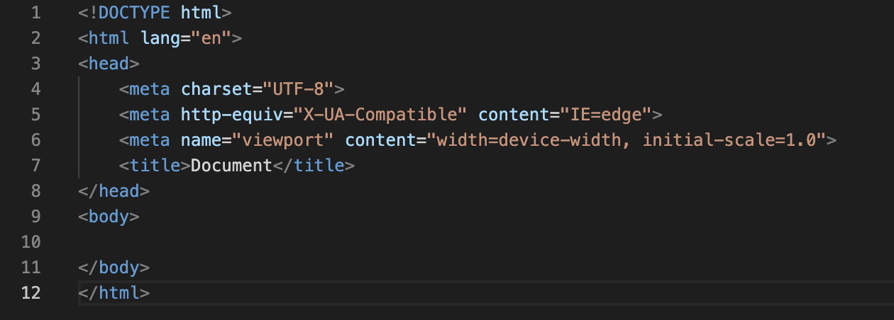

## Creación de repositorio en GitHub

1. Selecccionar el icono de la esquina derehca superior. 


2. Selecccionar en la pestaña abierta nuevo repositorio
    


        
        
3. Creamos uno nuevo
   

     
     
4. Introducimos el nombre del repositorio que estamos creando (sin espacios), añadimos una pequeña descripción y seleccionamos la casilla “Add a README       file”


    
    
    
5. Creamos el repositorio
    

    
    
6. Ya tenemos un repositorio nuevo creado, para editarle seleccionamos el icono en forma de lapiz de la derecha.


    
    
    
## Markdown
-**Encabezados**
 ```
    # Encabezado 1
    ## Encabezado 2
    ### Encabezado 3
    #### Encabezado 4
    ##### Encabezado 5
    ###### Encabezado 6
```

   # Encabezado1
   ## Encabezado 2
   ### Encabezado 3
   #### Encabezado 4
   ##### Encabezado 5
   ###### Encabezado 6
     
___
  
-**Párrafos y saltos de línea**
  
   Para realizar un salto de línea y empezar una frase en una línea siguiente dentro del mismo párrafo, tendrás que pulsar dos veces la barra espaciadora       antes de pulsar una vez intro.
  
   Otra manera de generar encabezados es con el símbolo ` = ` (para el encabezado 1), o con guiones ` - ` para el encabezado 2.
     
   ```
   Esto sería un encabezado 1
===
Esto sería un encabezado 2
—-
````
   
  ___   
       
-**Citas**

   Utilizando el carácter mayor que ` > ` al comienzo del bloque de texto.
     
   > Un país, una civilización se puede juzgar por la forma en que trata a sus animales.  — Mahatma Gandhi

   Incluso puedes concatenar varios ` >> ` para crear citas anidadas.
   > Esto sería una cita como la que acabas de ver.
> 
> > Dentro de ella puedes anidar otra cita.

  ___
  
-**Listas**

   Para crear listas desordenadas utiliza ` * ` asteriscos, ` - ` guiones, o ` + ` símbolo de suma.
   
````
- Elemento de lista 1
- Elemento de lista 2
* Elemento de lista 3
* Elemento de lista 4
+ Elemento de lista 5
+ Elemento de lista 6
````
- Elemento de lista 1
- Elemento de lista 2
* Elemento de lista 3
* Elemento de lista 4
+ Elemento de lista 5
+ Elemento de lista 6

  
    Para generar listas anidadas dentro de otras, simplemente tendrás que tabular:
  
````
- Elemento de lista 1
- Elemento de lista 2
    - Elemento de lista 3
    - Elemento de lista 4
 ````

- Elemento de lista 1
- Elemento de lista 2
    - Elemento de lista 3
    - Elemento de lista 4

___  
 
-**Listas ordenadas**
      
Para crear listas ordenadas debes utilizar la sintaxis de tipo: «número.» ` 1 ` . Al igual que ocurre con las listas desordenadas, también podrás anidarlas o combinarlas.

`````
1. Elemento de lista 1
2.  Elemento de lista 2
    - Elemento de lista 3
    - Elemento de lista 4
        
`````
1. Elemento de lista 1
2.  Elemento de lista 2
    - Elemento de lista 3
    - Elemento de lista 4
    
___        

-**Reglas horizontales**
      
   Se utilizan para separar secciones de una manera visual
`````
***
---
___
`````
***
---
___

    
___        
-**Elementos de línea**
         
| Markdown      | Resultado     |       
| ------------- |-------------  | 
| `*cursiva*`   | *cursiva*     | 
| `_cursiva_`   | _cursiva_     |   
| `**negrita**`	| **negrita**   |
| `__negrita__`	| __negrita__   |

   Tambien se pueden combinar
| Markdown      | Resultado     |       
| ------------- |-------------  | 
| `***cursiva y negrita***`   | ***cursiva y negrita***    | 
| `___cursiva y negrita___`   | ___cursiva y negrita___     |   

        
            
___
-**Links o enlaces**
  
   Se crean escribiendo la palabra o texto enlazada entre `[]` corchetes, y el link en cuestión entre `()` paréntesis.
   
   | Markdown      | Resultado     |       
| ------------- |-------------  | 
| `[enlace en línea](http://www.limni.net)	`   | [enlace en línea](http://www.limni.net)	    | 


___        
-**Código**
    
    La forma más sencilla de escribir código en Markdown es envolver el texto entre dos comillas sencillas.
    
   
    
   `Esto es una línea de código`
   
    
___        

-**Imágenes**
     
   Solo que en este caso, deberás añadir un símbolo de `!` exclamación al principio y el enlace no será otro que la ubicación de la imagen.

    ``


___    
-**Links automáticos**
     
   Para generar links automáticos tan solo tendrás que rodearlos con los símbolos `< >`
    `<http://www.limni.net>`
    <http://www.limni.net>

___        
        
-**Tablas**
     
     
   
    
| Tables        | Are           | Cool  |
| ------------- |:-------------:| -----:|
| col 3 is      | right-aligned | $1600 |
| col 2 is      | centered      |   $12 |
| zebra stripes | are neat      |    $1 |

___

-**Notas al pie de página**

   Texto con enlace a nota de pie de página `[^1]`

[^1]: Aquí encuentras el texto de la nota al pie de página.

___

-**Listas de verificación**

    [ ] A   [x] B   [ ] C

- [ ] A
- [x] B
- [ ] C

____

## HTML
    
-**Elementos principales**
    
   1. La etiqueta de apertura: consiste en el nombre del elemento (en este caso, p), encerrado por paréntesis angulares `< >` de apertura y cierre.
   2. La etiqueta de cierre: es igual que la etiqueta de apertura, excepto que incluye una barra de cierre `/` antes del nombre de la etiqueta.
   3. El contenido: este es el contenido del elemento, que en este caso es sólo texto.

___

-**Estructura de un documetno HTML**
   
- `<body></body>` Encierra todo el contenido que deseas mostrar a los usuarios web que visiten tu página, ya sea texto, imágenes, videos, juegos, pistas de audio reproducibles, y demás.
- `<title></title>` establece el título de tu página, que es el título que aparece en la pestaña o en la barra de título del navegador cuando la página es cargada, y se usa para describir la página cuando es añadida a los marcadores o como favorita.    
- `<head></head>` Este elemento actúa como un contenedor de todo aquello que quieres incluir en la página HTML que no es contenido visible por los visitantes de la página. Incluye cosas como palabras clave (keywords), una descripción de la página que quieres que aparezca en resultados de búsquedas, código CSS para dar estilo al contenido, declaraciones del juego de caracteres, etc. Incluie como:
    - Palabras clave (keywords)
    - Una descripción de la página que quieres que aparezca en resultados de búsquedas
    - Código CSS para dar estilo al contenido
    - Declaraciones del juego de caracteres: `<meta />— <meta>`. Añade metainformación a la página. Podemos poner varias marcas <meta> que dan información no visible del documento. En el caso del ejemplo, este elemento establece el juego de caracteres que tu documento usará en utf-8, que incluye casi todos los caracteres de todos los idiomas humanos. Básicamente, puede manejar cualquier contenido de texto que puedas incluir. No hay razón para no establecerlo, y puede evitar problemas en el futuro. 
    - El título de la página: `<title></title>` — el elemento <title> establece el título de tu página, que es el título que aparece en la pestaña o en la barra de título del navegador cuando la página es cargada, y se usa para describir la página cuando es añadida a los marcadores o como favorita.
    - El icono (llamado favicon) de la página. Podemos usar la etiqueta <link> y el atributo rel="icon" para agregar un favicon de navegador en HTML. El tamaño más común para crear un favicon es 16x16 píxeles. Sin embargo, también pueden aparecer en dimensiones un poco más grandes (32x32). Casi todos los navegadores modernos admiten imágenes PNG pero si nos encontramos con problemas, por ejemplo con navegadores como IE10 y sus versiones anteriores, podemos utilizar imágenes ICO.
    - El enlace con otros ficheros relacionados con el documento (hojas de estilo, codigo Javascrip…), etc.

    
- `<html></html>`  Este elemento encierra todo el contenido de la página entera y, a veces, se le conoce como el elemento raíz (root element).

___

-**Imágenes**
 
Como ya se dijo antes, incrusta una imagen en la página, en la posición en que aparece. Lo logra a través del atributo `src`  source, el cual contiene el path (ruta o ubicación) de tu archivo de imagen.

También se incluye un atributo `alt` alternative  el cual contiene un texto que debería describir la imagen, y que podría ser accedido por usuarios que no pueden ver la imagen, quizás porque
        
    
    
    
___
-**Encabezados**
    
HTML posee seis niveles de encabezados:

    
    <h1>Mi título principal</h1>
    <h2>Mi título de nivel superior</h2>
    <h3>Mi subtítulo</h3>
    <h4>Mi sub-subtítulo</h4>
    
    
   
    
<h1>Mi título principal</h1>
<h2>Mi título de nivel superior</h2>
<h3>Mi subtítulo</h3>
<h4>Mi sub-subtítulo</h4>
    
____
-**Vínculos**
    
Encierra el texto en un elemento `<a>`, así:
        
    <a>Manifesto Mozilla</a>
Proporciónale al elemento `<a>` un atributo href, así:
        
    <a href="">Manifesto Mozilla</a>

Completa el valor de este atributo con la dirección web con la que quieras conectar al vínculo:
        
    <a href="https://www.mozilla.org/es-AR/about/manifesto/">Manifesto Mozilla</a>
    
___
-**Elementos**
    
Para resaltar una palabra del texto, podemos encerrarla en un elemento `<strong>`
    
    <p>Mi gato es <strong>muy</strong> gruñon.</p>
        
<p>Mi gato es <strong>muy</strong> gruñon.</p>
    
    
___
    
## HTML
    
-**Características HTML**
    
    - **HyperText**, cuyo significado es hipertexto, que no es más que un texto que enlaza con otros contenidos.
    - **Markup**, que significa marca o etiqueta, ya que todas las páginas web están construidas en base a etiquetas.
    - **Language**, cuyo significado es lenguaje, porque HTML es un lenguaje, es decir, tiene sus normas, tiene su estructura y una serie de convenciones que nos sirven para definir tanto la estructura como el contenido de una web.
    - **La etiqueta de apertura**: consiste en el nombre del elemento (en este caso, p), encerrado por paréntesis angulares (< >) de apertura y cierre.
    - **La etiqueta de cierre**: es igual que la etiqueta de apertura, excepto que incluye una barra de cierre (/) antes del nombre de la etiqueta. 

-**Estructura documento HTML**
    
   - <!DOCTYPE html> — el tipo de documento.
   - <html></html> — el elemento <html>.
   - <head></head> — el elemento <head>.



    
    


    
    
    

    
